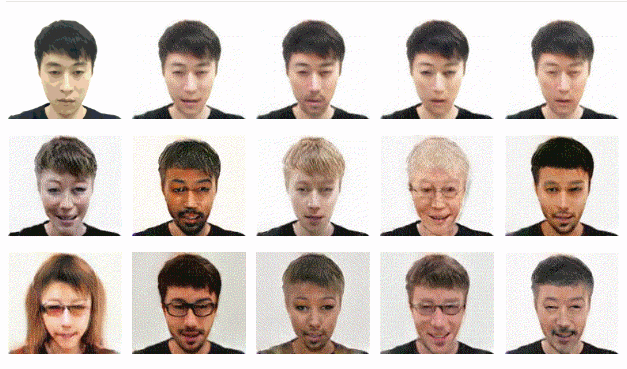

## About Me

<!--  -->

Hi! I am currently an undergraduate from Xiamen University waiting for the begining of my master's degree in [MAC Lab](https://mac.xmu.edu.cn).

I'm really interested in Computer Vision, including Image Generation, Text-to-Image Tranlsation and Image-to-Image Translation.

I aim at find out the Imagination Ability of Deep Neural Network in vision area. 

You can find my publication and source code on [GitHub](https://github.com/imlixinyang).

Email me at [imlixinyang@gmail.com](mailto:imlixinyang@gmail.com) any time you want!

## Recent News

* [2019.05.24] Repo for AGUIT has been created: [[Repo of AGUIT]](https://github.com/imlixinyang/aguit).

* [2019.04.29] Preprint submission: [[Attributed Guided Unpaird Image-to-Image Translation with Semi-supervised Learning]](https://arxiv.org/abs/1904.12428).

## Publications

### Preprint:

* Attributed Guided Unpaird Image-to-Image Translation with Semi-supervised Learning  
  by Xinyang Li, Jie Hu, Shengchuan Zhang, Xiaopeng Hong, Qixiang Ye, Chenglin Wu, Rongrong Ji 
  [[Code]](https://github.com/imlixinyang/aguit) [[Paper]](https://arxiv.org/abs/1904.12428)

## Intership

* [2018.10 ~ 2019.6] Research intern of Computer Vision [Social Bird AI lab](http://www.socialarks.com/).

## Award

* [2018.2] COMAP's Mathematical Contest in Modeling (MCM) 
  Meritorious Winner (7%)

* [2017.8] CUMCM (Contemporary Undergraduate Mathematical Contest in Modeling) 
  1st Prize, National 
  Promblem Analysis, Modeling and Programing; Solution Modeling and Programing; Writing in Math
